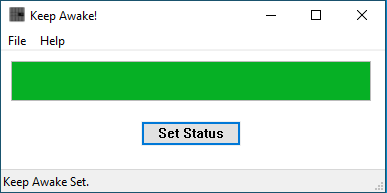
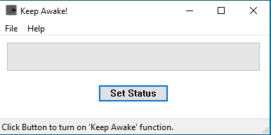

# Keep Awake

Keep Awake is a Win32 Program to keep your computer from going to sleep. When unable to change sleep settings on a computer, this will allow you to keep your computer from locking out.

Inspired by being at a business where several users use the same computer, but the IT set the screen to lock after 5 minutes. Renders the shared computer useless. Similar to programs such as 'Mouse Jiggler' and 'Caffeine'.

Created as a challenge to myself to:
- Use Win32 API
- Create it as a small progrma.

## How it Works

The ```SetThreadExecutionState();``` [function](https://learn.microsoft.com/en-us/windows/win32/api/winbase/nf-winbase-setthreadexecutionstate) can keep the computer awake. The rest of the code creates the Win32 application.

One Line Makes it work:
```C++
SetThreadExecutionState(ES_CONTINUOUS | ES_DISPLAY_REQUIRED | ES_SYSTEM_REQUIRED);
```


*Program Running in 'On' State*


*Program Running in 'Off' State*


*Program Minimized to Taskbar*


## Installation

The .exe file in the Releases are all you need. Open to run and minimize it to tray and forget.

Enabling the program as a startup on windows:

- <kbd>⊞ Win</kbd>+<kbd>R</kbd>
- Enter ```shell:startup``` and hit enter.
- Copy the .exe from the Releases to the folder that pops up.


## Uninstall


- <kbd>⊞ Win</kbd>+<kbd>R</kbd>
- Enter ```shell:startup``` and hit enter.
- Remove the .exe from the Releases to the folder that pops up.


## License

Skelton Networks © 2023 [MIT](./LICENSE)
